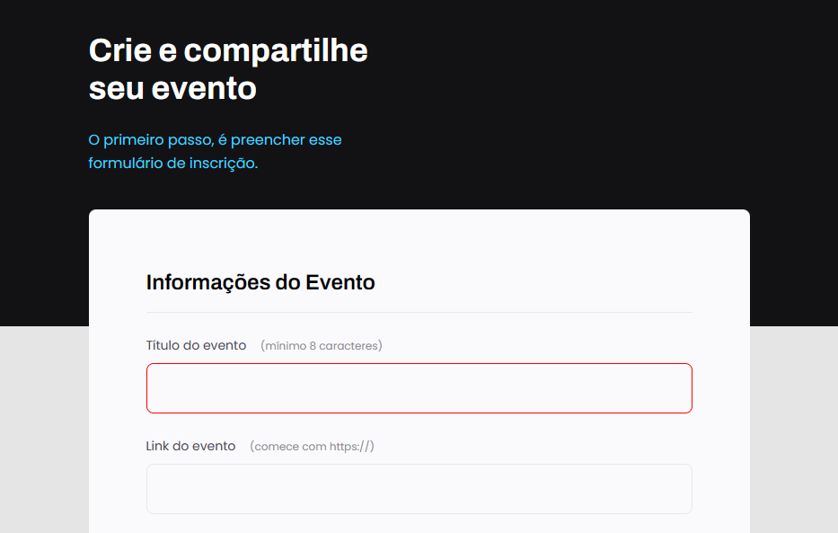
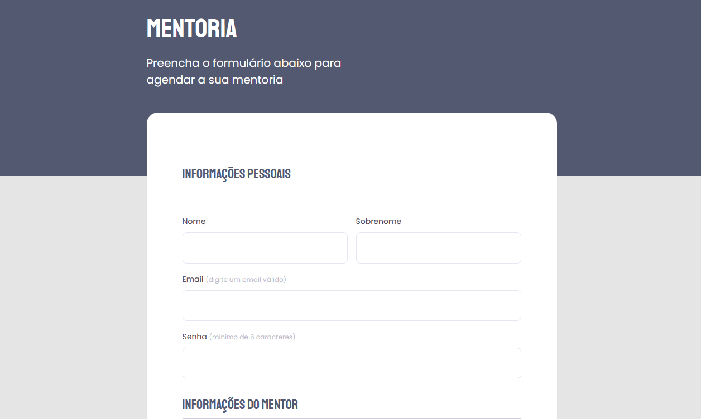

<h1 align="center">STUDY FORMS!! 📑</h1>
 
 
## 📑Evaluation Mentoring Form.

  

 

## 📑Event Form.

  

 

## 📑Mentoring Form.

  

## 🚀 Tecnologias.

Esse projeto foi desenvolvido com as seguintes tecnologias:

- HTML e CSS.
- Git e Github.
- Figma.
